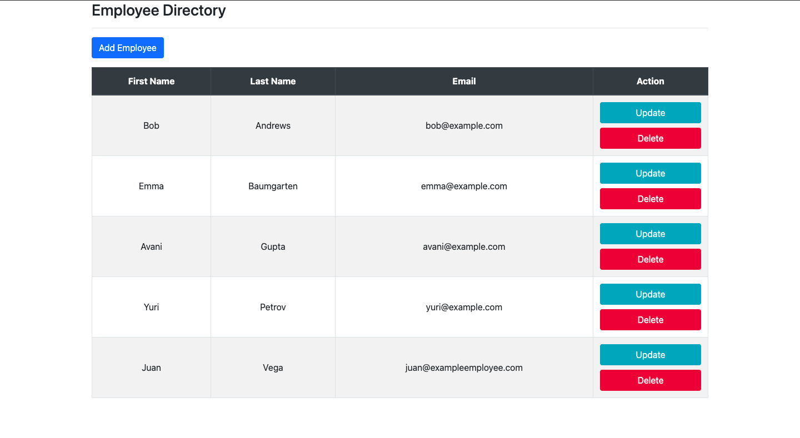
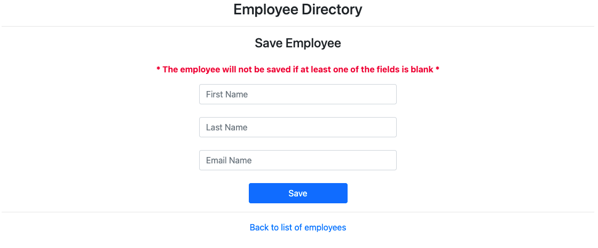

# Employee Web Application

The user can perform CRUD operations.

#### Technologies used

1. Maven
2. Spring Boot
3. Spring Web MVC
4. Spring Data JPA
6. Thymeleaf
7. Hibernate
8. MySQL
9. JDBC

### Description

Application allows user to perform CRUD operations on an 
<a href="src/main/java/com/spencer/forrest/employee/entity/Employee.java" target="employee">employee.</a>

##### List of Employees

##### Add / Update employee form

##### Delete confirmation of an employee

### Software Architecture

There are 3 layers:
1. <a href="src/main/java/com/spencer/forrest/employee/controller" target="controller">Controller</a>
2. <a href="src/main/java/com/spencer/forrest/employee/service" target="service">Service</a>
3. <a href="src/main/java/com/spencer/forrest/employee/repository" target="repository">JPA Repository</a>

### Database
The file <a href="sql/employee.sql" target="sql">employee.sql<a/> is a script to create an employee table and insert 
sample data. 
The <a href="src/main/resources/application.properties" target="properties">application.properties</a> file contains 
the information needed for the application to connect to a database (url, username, password).
